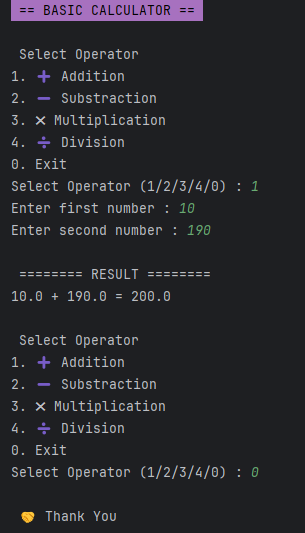

# 🧮 Basic Calculator (Python CLI)

A simple **Python-based Command Line Interface (CLI)** calculator program to perform basic mathematical operations such as addition, subtraction, multiplication, and division.

---

## 📌 Features

* Input 2 numbers
* Operator selection menu:
  * ➕ Addition
  * ➖ Subtraction
  * ✖ Multiplication
  * ➗ Division
* Input validation (accepts numbers only)
* Error handling:
  * Invalid input detection
  * Division by zero handling
* Program looping (no need to restart)
* Colored CLI display (using ANSI escape codes)

---

## 🛠️ Tech Stack

* Python 3.14
* Command Line Interface (CLI)

---

## ▶️ How to Run

1. Ensure Python is installed on your computer.

2. Clone repository:

   ```bash
   git clone https://github.com/CountryIna/basic_calculator.git
   ```

3. Navigate to the project folder:

   ```bash
   cd basic_calculator
   ```

4. Run the program:

   ```bash
   python calculator.py
   ```

---

## 💻 Output Example

 Here is an example of the program output when run in the terminal:



---

## ⚠️ Important Notes

* Use a **dote (.)** for decimal numbers
  ✔ Example: `3.5`
  ❌ Incorrect: `3,5`

* Any input orther than numbers will be rejected by the program

---

## 📚 Project Objectives

This project was created to:
* Learn Python basics
* Understand core concepts:
  * Input & Output
  * Conditional Statements (`if-else`)
  * Loops (`while`)
  * Error handling (`try-except`)
* Practice fundamental programming logic

---

## 🚀 Future Improvements

Ideas for further development:
* Adding calculation history
* Supporting more than 2 numbers
* Converting into a web-based calculator

---

## 🤝 Contrubution

Contributions are welcome! Feel free to fork this repository and enhance it as needed.

---

## 👨‍💻 Author

Created by **[Country Ina]**

---
